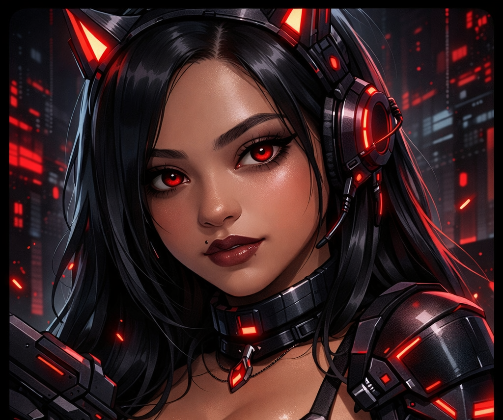

<!-- FUNDO ANIMADO -->

 

<!-- MASCOTE NEON -->

 

 <b>プ ロ グ ラ マ</b> <samp>   Hi there! I'm <b>⛤ Sara Kathlen ⛤</b> </samp> 

 

 

  

  

    
 
 <samp> <b>More Info</b> </samp> 
   ##   
 <samp> <b> Contact me: </b> </samp>         
 
 
 <samp> ♡ <a href="https://rentry.co/kamillymedino">rentry</a> ⊹ <a href="https://linktr.ee/kamillyvm1">linktr.ee</a> ⊹ <a href="https://kamillymedino.carrd.co/">carrd.co</a> ⊹ <a href="https://cyber-buttercup-43c.notion.site/My-universe-191f307c822780fba1dae4c8a8fc6069">notion</a> ♡ </samp> 
 
   

  

 

